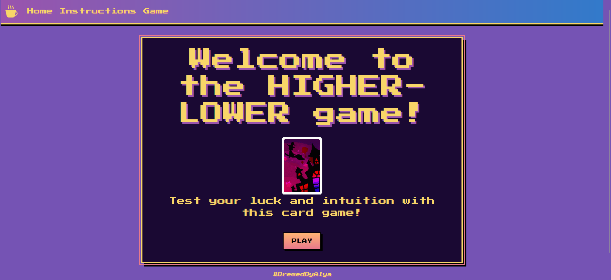

# HIGHER and LOWER game

## 🕹️ Description

This is a simple higher-lower cardgame game made with HTML, CSS, bootstrap, and JavaScript.  
The player chooses guessed whether the next card is higher or lower.  
If they guess right, they get a coin. If they guess wrong, it's game over. Get 10 coins to win.

## 🚀 Getting Started

👉 **Play it** [here!](https://brewedbyalya.github.io/HigherLower-BrowserGame/mainpage.html)

👉 **Planning Materials:**
 [User Stories + Wireframe](https://trello.com/b/RyrGqcxp/higher-lower-game)

### How to Play
1. Open the link to the game.
2. Click start.
3. Click higher or lower.
4. The hidden card is then shown. Get to ten points to win!

## 💡 Technologies Used

- HTML
- CSS
- Bootstrap
- JavaScript

## 📚 Attributions

- [Playing cards made by BlueIZ.](https://witchs-heart.fandom.com/wiki/Minigame/Gallery#Noel's_Minigame_(High-Low))

## 🚧 Next Steps

- Add difficulty levels.